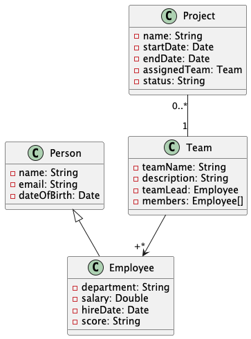

# Wad Lab 3 - JPA + Postgres + Redis

## Laboratory request

Domain:


In this exercise we will use Spring Data JPA to access the database.

Implement the above domain model as entity classes. Populate (from Java) the entities with meaningful data.

Test by retrieving objects from the database using their ids (see the course)

Solve the following queries in JPQL. Display the results.


1) Given employee email → return full employee details (including department, salary, hire date, score).
2) Given team name → list all team members.
3) Given team name → return the team lead.
4) Given project name → return the assigned team and project status.
5) Given employee name → list all teams the employee belongs to.
6) Given salary threshold → list all teams that have at least one employee earning above that amount.

## Install Docker Desktop

### Windows
1. Download Docker Desktop for Windows: https://www.docker.com/products/docker-desktop/
2. Run the installer. If prompted, enable WSL 2 and the Virtual Machine Platform feature.
3. Restart if required, then open Docker Desktop.
4. Verify in a terminal:
   - `docker --version`
   - `docker compose version`

### macOS
1. Download Docker Desktop for Mac: https://www.docker.com/products/docker-desktop/
2. Open the .dmg and drag Docker to Applications.
3. Launch Docker Desktop and finish the setup prompts.
4. Verify in a terminal:
   - `docker --version`
   - `docker compose version`

## Start the services
From the repo root:
```
docker compose up -d
```

## Stop the services
```
docker compose down
```

## Remove data (optional)
```
docker compose down -v
```

## Connection info
Postgres:
- Host: `localhost`
- Port: `5432`
- User: `app`
- Password: `app_password`
- Database: `app_db`

Redis:
- Host: `localhost`
- Port: `6379`

## Customize
Edit `docker-compose.yml` to change ports or credentials.
